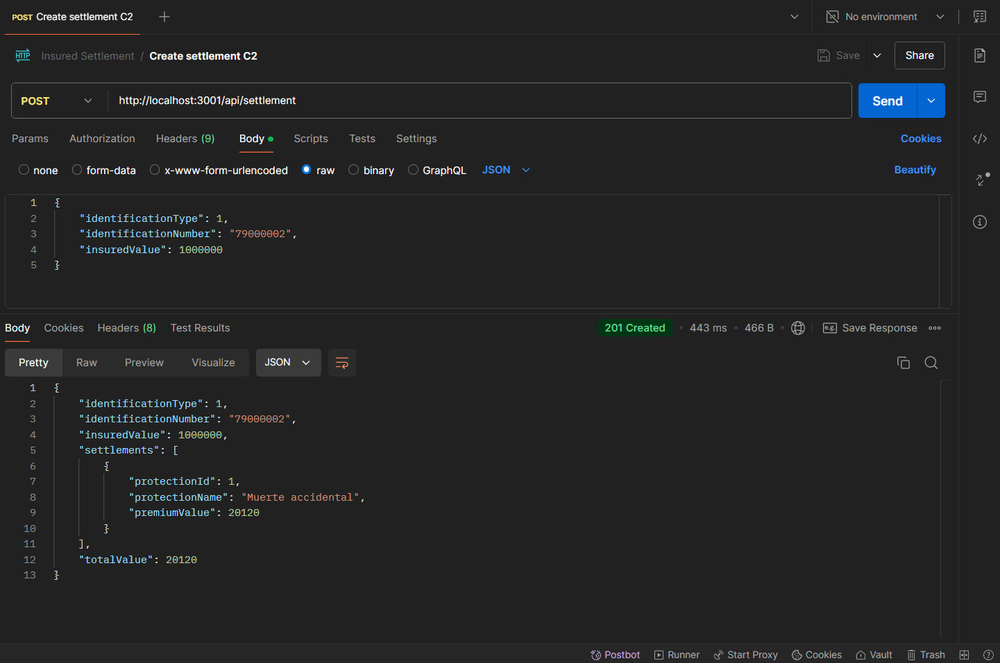

# Insured Settlement 🚀

Insured Settlement is a server application created with NestJS and documented with Swagger. Its implementation aims to calculate the insurance premium settlement based on the insured value provided by the client. The client's age determines the protections they are entitled to.

## Features

- Calculate insurance premium settlements based on the insured value provided by the client.
- Determine the entitlements to protections based on the client's age.
- Comprehensive API documentation through Swagger for easy integration and understanding of endpoints.

## Technologies Used

- **TypeScript**: A typed superset of JavaScript that compiles to plain JavaScript.
- **NestJS**: A progressive Node.js framework for building efficient and scalable server-side applications.
- **Prisma**: An open-source database toolkit for TypeScript and Node.js.
- **PostgreSQL**: realitonal database for storing data.
- **Swagger**: API documentation and testing tool for RESTful services.

## Installation

1. Clone the repository:

   ```bash
   git clone https://github.com/Cristianjs93/insured-settlement.git
   ```

2. Navigate to the project directory:

   ```bash
   cd insured-settlement
   ```

3. Install the dependencies:

   ```bash
   npm install
   ```

## Usage

1. Run the application:

   ```bash
   npm start
   ```

2. The application will be running on:

   ```
   http://localhost:3001/api
   ```

3. Swagger documentation is available on:

   ```
   http://localhost:3001/api/docs
   ```

4. You can find a SQL script in the `database` folder to create your database.

## Testing

Unit tests were applied to controllers, services, and utility functions to ensure the functionality and correctness of the core logic. The tests are run using Jest, and can be executed with the following command:

```bash
npm run test
```

## Environment

Follow the `.env.example` file to add the required variables.

## API Endpoints

| Endpoint          | Method | Description                                | Request Body                                                                                | Response                                                                                                                               |
| ----------------- | ------ | ------------------------------------------ | ------------------------------------------------------------------------------------------- | -------------------------------------------------------------------------------------------------------------------------------------- |
| `/api`            | GET    | Server healthcheck.                        |                                                                                             | "Web service is available"                                                                                                             |
| `/api/settlement` | POST   | Calculate the insurance premium settlement | `{ "identificationType": 1,  "identificationNumber": "79000002", "insuredValue": 1000000 }` | `{ "identificationType": 1, "identificationNumber": "79000002", "insuredValue": 1000000,  "settlements": [...], "totalValue": 20120 }` |

## Screenshots


_*Settlement calculation*_

## Contributing

If you would like to contribute to this project, please fork the repository and submit a pull request. Any contributions, whether improvements or bug fixes, are welcome!

## License

This project is licensed under the MIT License.
